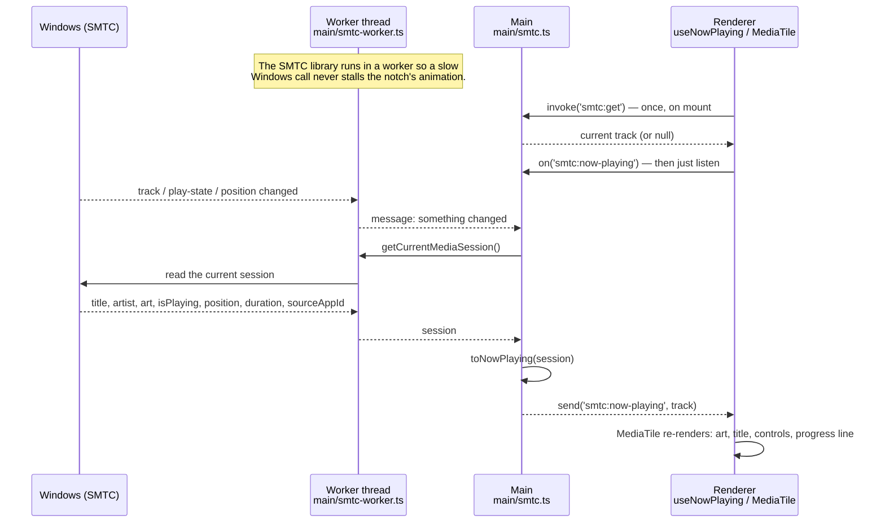
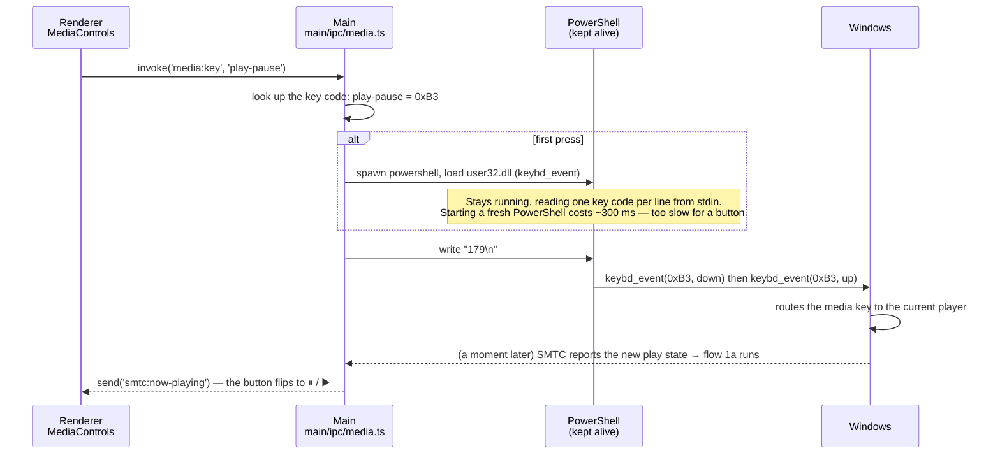
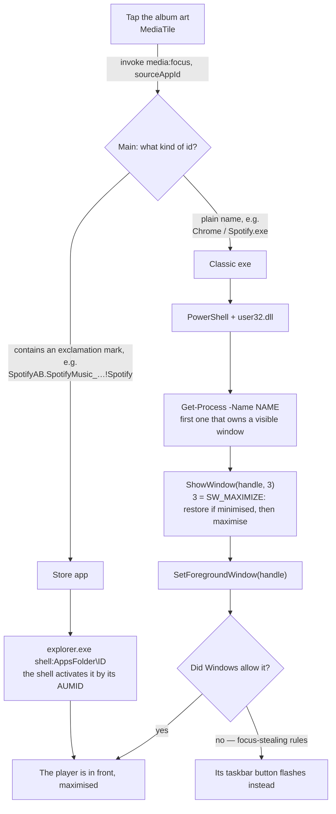
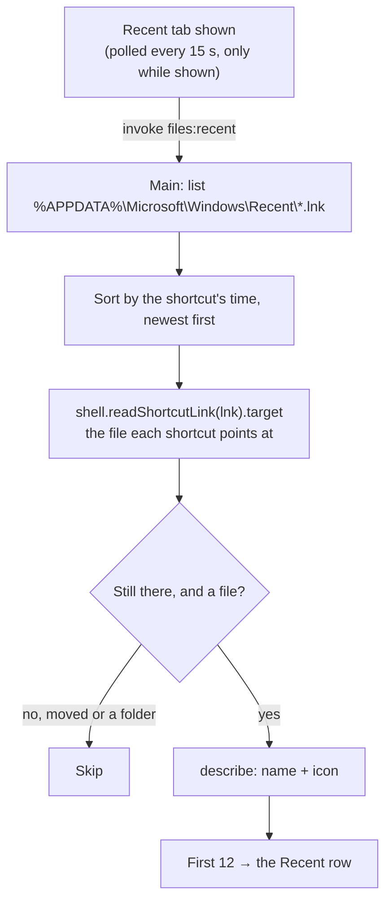
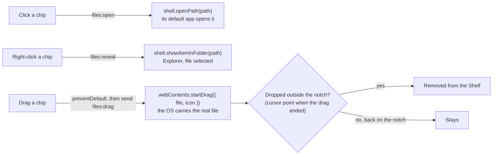
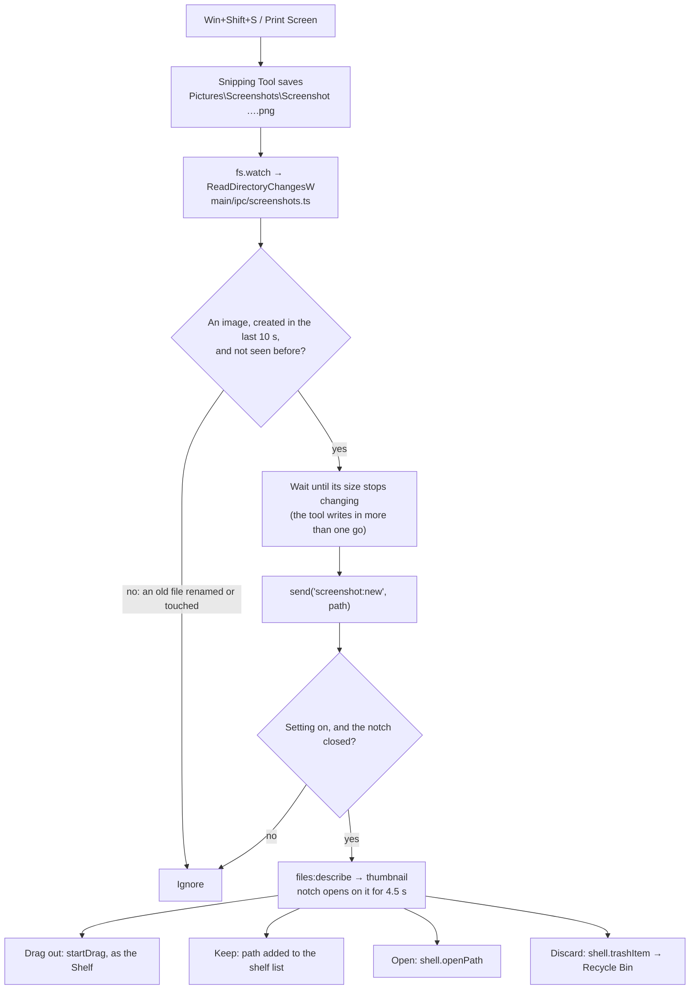
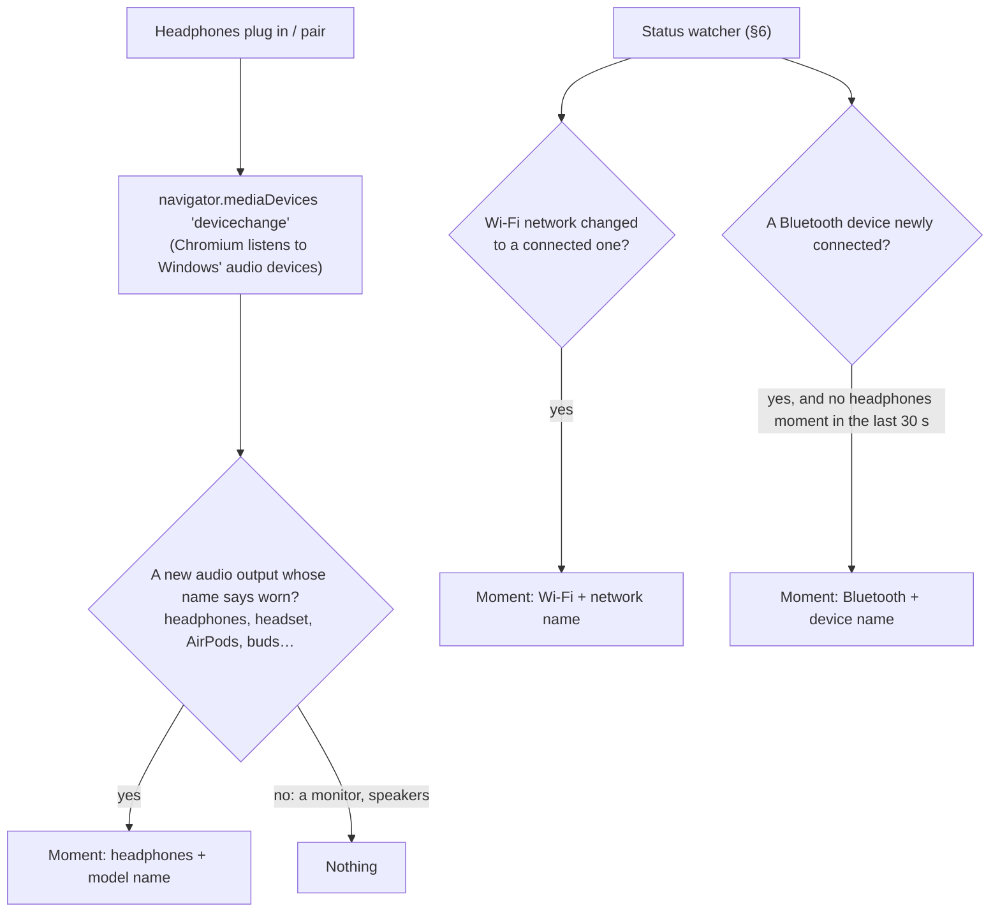
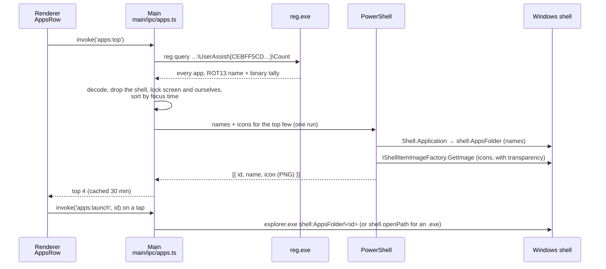

# How deskNotch talks to Windows

Everything below is where deskNotch genuinely touches Windows (settings and tasks are just JSON in a store file, so they are left out). None of it uses a native Node module: every feature leans on something Windows already provides.

| Mechanism | What it is | Used for |
|---|---|---|
| **SMTC** (System Media Transport Controls) | Windows' own "now playing" registry. Every player (Spotify, Chrome, Edge, VLC…) reports its track, artwork, play state and position to it. | Reading what's playing |
| **Media keys** | The play/pause/next/previous keys on a keyboard. Windows routes them to whichever player is current, no focus needed. | Controlling playback |
| **`user32.dll`** | The Windows window manager API. `ShowWindow` restores a window, `SetForegroundWindow` brings it to the front. | Opening the player |
| **Click-through window** | `setIgnoreMouseEvents(…, { forward: true })` on a transparent, always-on-top window. | The notch not blocking the desktop (§4) |
| **Shell drag and drop, thumbnails, Recycle Bin** | `webContents.startDrag`, `nativeImage.createThumbnailFromPath`, `shell.trashItem`. | The Shelf (§3), screenshots (§5) |
| **Folder change notifications** | `fs.watch`, which is `ReadDirectoryChangesW` underneath. | Catching screenshots (§5) |
| **CapabilityAccessManager** | The registry record behind Windows' own "an app is using your microphone" icon. | Privacy dots (§6) |
| **`netsh wlan`, PnP device properties** | Wi-Fi state, and whether each paired Bluetooth device is connected. | Wi-Fi and Bluetooth moments (§6, §7) |
| **Audio endpoints** | The browser's `devicechange` event over Windows' audio device list. | Headphones moment (§7) |
| **UserAssist** | Explorer's per-app launch and focus-time tally, behind the Start menu's "Most used". | Most used apps (§8) |
| **Shell `AppsFolder` + `IShellItemImageFactory`** | The Start menu's own list of apps, and the shell's icon renderer. | App names, icons, launching (§8) |

The notch runs in two halves, like every Electron app:

- **Renderer** — the notch you see. React, in [renderer/](renderer/). It cannot touch the OS.
- **Main** — a Node process with OS access, in [main/](main/). It does everything below and hands results to the renderer over **IPC** (`window.bridge.invoke('channel', …)` on one side, `ipcMain.handle('channel', …)` on the other).

Every diagram uses those two lanes plus a third for Windows.

> The diagrams are [Mermaid](https://mermaid.js.org/). GitHub draws them as-is; VS Code's built-in preview needs the **Markdown Preview Mermaid Support** extension (`bierner.markdown-mermaid`), otherwise they show as code.

---

## 1. Media playback

Two directions: **reading** what's playing (continuous) and **controlling** it (on click). They use different mechanisms, because the library we read with can only observe.

### 1a. Reading what's playing



Key points:

- **Push, not poll.** The worker subscribes to SMTC events and tells main when anything changes; main re-reads once and pushes to the renderer. The renderer asks only once, on mount, because main already knows the track before the UI exists.
- **Position** arrives only when SMTC reports a change (every few seconds for most players). Between reports the progress line keeps moving at real time while playing, so it never looks stalled: [useMediaProgress.ts:9](renderer/hooks/useMediaProgress.ts#L9).
- **`sourceAppId`** is the player's identity (`Chrome`, `Spotify.exe`, or a Store app id like `SpotifyAB.SpotifyMusic_…!Spotify`). Feature 2 needs it.

Where the code is:

| Step | File |
|---|---|
| Worker: subscribes to SMTC, forwards events | [main/smtc-worker.ts:111](main/smtc-worker.ts#L111) |
| Main: spawns the worker, re-reads on events, pushes to the UI | [main/smtc.ts:63](main/smtc.ts#L63), [smtc.ts:65](main/smtc.ts#L65), [smtc.ts:70](main/smtc.ts#L70), [smtc.ts:103](main/smtc.ts#L103) |
| Renderer: asks once, then listens | [renderer/hooks/useNowPlaying.ts:22](renderer/hooks/useNowPlaying.ts#L22) |
| Renderer: the card | `MediaTile` in [renderer/components/widgets/GlanceTiles.tsx:22](renderer/components/widgets/GlanceTiles.tsx#L22) |

### 1b. Controlling playback (play / pause / next / previous)

The SMTC library only *observes*; it has no play or skip method. So the buttons send the **system media keys**, exactly what a keyboard sends, which every player honours whether or not it has focus.



Key points:

- **One long-lived PowerShell** for keys, not one per press. It is started on the first press and killed when the app quits ([media.ts:32](main/ipc/media.ts#L32)).
- **No optimistic UI.** The button doesn't flip itself; it flips when SMTC confirms the change (usually within ~100 ms). What you see is always the truth.
- **Key codes:** `play-pause` 0xB3, `next` 0xB0, `previous` 0xB1 ([media.ts:11](main/ipc/media.ts#L11)).
- **Two players open?** Windows sends the key to whichever it considers current, same as your keyboard would.

Where the code is:

| Step | File |
|---|---|
| Buttons call `media:key` | [GlanceTiles.tsx:75-77](renderer/components/widgets/GlanceTiles.tsx#L75-L77) |
| Handler + key server | [main/ipc/media.ts:69](main/ipc/media.ts#L69), [media.ts:32](main/ipc/media.ts#L32) |

---

## 2. Opening the player (tap the album art)

Tapping the art brings the app that's playing to the front, maximised. It relies on the `sourceAppId` that SMTC gave us in 1a.



Key points:

- **Store apps vs exes** are different animals. A Store app has no exe you can name; the shell activates it by its AUMID. A classic app is found by process name.
- **Best effort.** Windows may refuse to hand focus from one process to another. When it does, the target's taskbar button flashes, which is the OS's own fallback, not ours.
- **Safety:** the id is validated against `^[\w.!-]+$` before it goes anywhere near a shell command ([media.ts:74](main/ipc/media.ts#L74)).

Where the code is:

| Step | File |
|---|---|
| The art is a button | [GlanceTiles.tsx:34-38](renderer/components/widgets/GlanceTiles.tsx#L34-L38) |
| Handler, Store branch, exe branch | [main/ipc/media.ts:73](main/ipc/media.ts#L73), [media.ts:75](main/ipc/media.ts#L75), [media.ts:59](main/ipc/media.ts#L59) |

---

## 3. The Shelf tab (Recent and Pinned parked)

> **Current state:** only the Shelf is shown — a slim tray, left to right, that widens per file up to 640px and then scrolls sideways; files show a thumbnail where Windows has one, and a file dragged out and dropped elsewhere leaves the shelf. Recent and Pinned are commented out in `FileStrip.tsx`; their code below still exists and comes back by uncommenting.

Its own view in the notch (the Shelf circle on the side rail), with a switch between three lists. It replaced an open-apps dock, which only duplicated the taskbar, and moved off the Desk so the Desk stays about focus and tasks.

| Tab | What it holds | Where it comes from | Saved? |
|---|---|---|---|
| **Shelf** | Files you parked for later | Dropped onto the strip | Yes, store key `shelf` |
| **Recent** | Files you opened lately | Windows' own Recent folder | No, read live |
| **Pinned** | Favourite files and folders | Dropped onto the strip | Yes, store key `pins` |

Every file chip works the same: **click** opens it, **right-click** shows it in its folder, **drag** carries the real file out to wherever you drop it. Shelf and Pinned chips have a remove × on hover.

### 3a. Dropping files in

```mermaid
sequenceDiagram
    participant X as Explorer / desktop
    participant R as Renderer<br/>home.tsx + FileStrip
    participant P as Preload<br/>main/preload.ts
    participant M as Main<br/>main/ipc/files.ts

    X->>R: a file is dragged over the notch, even collapsed (dragenter)
    R->>R: open the notch on Files › Shelf and lock it open,<br/>outline the drop area in the companion's colour
    X->>R: drop
    R->>P: bridge.pathOf(file)
    Note over P: Electron 43 no longer puts .path on File;<br/>webUtils.getPathForFile gives the real path.
    P-->>R: "D:\Work\notes.txt"
    R->>M: invoke('files:describe', [paths])
    M->>M: stat each path, read its icon (cached as an image)
    M-->>R: [{ path, name, isDir, icon }]
    R->>R: add to the Shelf (or Pinned) and save the paths
```

### 3b. Recent files



### 3c. Opening, revealing, dragging out



On Windows `startDrag` runs the system drag loop and only returns when the drag ends, so the main process reads `screen.getCursorScreenPoint()` right then and the renderer checks it against the notch's rectangle ([files.ts:140](main/ipc/files.ts#L140)). Thumbnails come from the image itself for pictures, and from `nativeImage.createThumbnailFromPath` (the same thumbnails Explorer shows) for videos, PDFs and the rest ([files.ts:40](main/ipc/files.ts#L40)).

Every path is checked to be absolute before it reaches the shell ([files.ts](main/ipc/files.ts)).

Where the code is:

| Step | File |
|---|---|
| The strip, its tabs, chips, drop zone | `FileStrip` in [renderer/components/widgets/FileStrip.tsx:78](renderer/components/widgets/FileStrip.tsx#L78) |
| Chip drag-out | [FileStrip.tsx:32](renderer/components/widgets/FileStrip.tsx#L32) |
| Drop handling | [FileStrip.tsx:118](renderer/components/widgets/FileStrip.tsx#L118) |
| Opening the notch on Files when a file is dragged in | [renderer/pages/home.tsx](renderer/pages/home.tsx) (the `dragenter` listener) |
| Locking it open on a file drag | `onDragEnter` in [renderer/components/notch/NotchChassis.tsx](renderer/components/notch/NotchChassis.tsx) |
| Saved lists, recent polling, dropped paths | [renderer/hooks/useFiles.ts:15](renderer/hooks/useFiles.ts#L15), [useFiles.ts:46](renderer/hooks/useFiles.ts#L46), [useFiles.ts:73](renderer/hooks/useFiles.ts#L73) |
| `pathOf` for dropped files | [main/preload.ts:12](main/preload.ts#L12) |
| Describe, recent, open, reveal, drag | [main/ipc/files.ts:33](main/ipc/files.ts#L33), [files.ts:55](main/ipc/files.ts#L55), [files.ts:94-103](main/ipc/files.ts#L94-L103) |

---

## 4. The notch window itself (click-through)

The notch lives in a transparent, frameless, always-on-top window as wide as the screen and 500px tall. Almost all of that window is empty, and it must never swallow a click meant for whatever is underneath.

```mermaid
sequenceDiagram
    participant R as Renderer<br/>NotchChassis
    participant M as Main<br/>main/main.ts
    participant W as Windows

    R->>M: send('notch:bounds', [notch, dock, apps bar])<br/>on every resize (ResizeObserver)
    loop every 60 ms
        M->>W: screen.getCursorScreenPoint()
        M->>M: is the cursor inside any of those rectangles?
        M->>W: setIgnoreMouseEvents(!inside, { forward: true })
        M-->>R: send('notch:cursor', {x, y}) when the cursor moved
    end
    R->>R: pointer left? close only once it is 48px away<br/>and still heading away
    R->>M: send('notch:pinned', true) when locked
    M->>W: mainWindow.focus() (so typing works); blur() when unlocked
```

- Outside the rectangles, the window ignores the mouse and Windows delivers clicks to what is below. `forward: true` still lets the page see mouse moves.
- Closing uses the **real cursor from the main process**, not browser events: past the edge the window stops taking the mouse, so the page is told the pointer left the moment it crosses, and while the notch resizes under a still pointer the browser sends moves that are not real. So the notch closes only on real movement away ([NotchChassis.tsx:151](renderer/components/notch/NotchChassis.tsx#L151)).
- Code: the hit test and cursor feed at [main.ts:60](main/main.ts#L60), bounds at [main.ts:93](main/main.ts#L93), focus on lock at [main.ts:99](main/main.ts#L99).

## 5. Screenshot catcher

Windows 11's Snipping Tool (Win+Shift+S, Print Screen) saves every capture to `Pictures\Screenshots`. Watching that folder catches them as real files, for the cost of a folder watch: no polling.



- Watches `Pictures\Screenshots`, and `OneDrive\Pictures\Screenshots` when it exists.
- **Discard** goes to the Recycle Bin, so a slip can be undone, and the main process refuses any path that is not an image directly inside one of those folders ([screenshots.ts:38](main/ipc/screenshots.ts#L38)).
- Code: the watcher at [screenshots.ts:46](main/ipc/screenshots.ts#L46), the size check at [screenshots.ts:25](main/ipc/screenshots.ts#L25), the card in [CaptureView.tsx](renderer/components/widgets/CaptureView.tsx), opening and folding in `peek` in [home.tsx](renderer/pages/home.tsx).

## 6. Status watcher: privacy dots, Wi-Fi, Bluetooth

One PowerShell, kept alive, answers three questions and prints a line only when an answer changes.

**Microphone and camera.** Windows keeps, for its own tray icon, a record of every app that has asked for either:

```
HKCU\Software\Microsoft\Windows\CurrentVersion\CapabilityAccessManager\ConsentStore\
    microphone\<app>\  LastUsedTimeStart, LastUsedTimeStop
    webcam\<app>\      LastUsedTimeStart, LastUsedTimeStop
```

A `LastUsedTimeStop` of **0** (with a start time set) means "still using it right now".

**Wi-Fi.** `netsh wlan show interfaces`: its State, SSID and Signal lines.

**Bluetooth.** `Get-PnpDevice -Class Bluetooth`, keeping real devices (not the radio, adapters or profiles), then each one's "is connected" device property (`{83DA6326-97A6-4088-9453-A1923F573B29} 15`). Asking every device takes a second or two, so this runs least often.

```mermaid
sequenceDiagram
    participant R as Renderer<br/>usePrivacy, home.tsx
    participant M as Main<br/>main/ipc/privacy.ts
    participant P as PowerShell (one, kept alive)
    participant W as Windows

    R->>M: invoke('privacy:get') (first ask starts the watcher)
    M->>P: spawn, with our process id
    loop every 1.5 s
        P->>W: ConsentStore: any mic / webcam app with Stop = 0?
        P->>W: every ~10 s: netsh wlan show interfaces
        P->>W: every ~30 s: connected Bluetooth devices
        P-->>M: "mic,camera TAB ssid|signal TAB device;device" (only when it changed)
        M-->>R: send('privacy:state', { mic, camera, wifi, bluetooth })
    end
    Note over P: exits by itself if our process is gone
```

What the closed bar does with it:

- **Privacy dots**, all the time: orange while the microphone is in use, green for the camera, as on the iPhone.
- **Wi-Fi and Bluetooth** are not shown all the time. They get a moment (§7) only when something **connects**: a new network, or a Bluetooth device that was not connected before.

Code: [privacy.ts](main/ipc/privacy.ts) (script and watcher), [usePrivacy.ts](renderer/hooks/usePrivacy.ts).

## 7. "Just connected" moments (headphones, Wi-Fi, Bluetooth)

When something connects, the closed bar gives itself to it for about a second and a half: the icon swings in, then the name and "Connected", then it slides away and the usual bar returns.



- What is already connected when the app starts is not news: Wi-Fi and Bluetooth changes count only after a 12 s warm-up, and devices present at start are remembered.
- A Bluetooth headset shows as both headphones (instantly, from `devicechange`) and a Bluetooth device (later, from the watcher); the headphones moment wins, so it is not announced twice.

Code: [useHeadphones.ts](renderer/hooks/useHeadphones.ts), the moments in [home.tsx](renderer/pages/home.tsx), the view in [CollapsedStatus.tsx](renderer/components/notch/CollapsedStatus.tsx).

## 8. Most used and favourite apps

**Most used** is Windows' own count. Explorer keeps a tally per app under `UserAssist` (the Start menu's "Most used" is built from it). Each value's name is the app, **ROT13-encoded**, and its 72-byte data holds the launch count (bytes 4–7) and **time in focus in ms** (bytes 12–15).



- An app's id is its **AppUserModelID** (`Chrome`, `5319275A.WhatsAppDesktop_…!App`) or an `.exe` path. `shell:AppsFolder\<id>` launches either kind, Store apps included.
- **Favourites** are picked from the whole `shell:AppsFolder` list (every app in the Start menu), searched by name; names and icons come from the same PowerShell pass, cached per app.
- Icons: most apps are Store-style and have no `.exe` Electron can read an icon from, so a small C# helper (compiled in PowerShell with `Add-Type`) asks the shell's own icon renderer, the same icons the Start menu shows.
- The page can only launch an id the main process has itself listed (most used, or installed), never an arbitrary path ([apps.ts:163](main/ipc/apps.ts#L163)).
- Code: tally at [apps.ts:25](main/ipc/apps.ts#L25), ROT13 at [apps.ts:22](main/ipc/apps.ts#L22), names and icons at [apps.ts:44](main/ipc/apps.ts#L44), the installed list at [apps.ts:131](main/ipc/apps.ts#L131).

## 9. Smaller touches

| What | How it talks to Windows | Code |
|---|---|---|
| Glass tint from the wallpaper | Reads `%APPDATA%\Microsoft\Windows\Themes\TranscodedWallpaper`, the copy of the current wallpaper Windows keeps | [system.ts:20](main/ipc/system.ts#L20) |
| Accent colour | `systemPreferences.getAccentColor()`, the colour set in Personalisation | [system.ts:40](main/ipc/system.ts#L40) |
| 12-hour clock | Built from the system time; the closed bar shows it on the left whenever no focus session or music is running | [time.ts](renderer/lib/time.ts) |
| Start on boot | `app.setLoginItemSettings({ openAtLogin })`, which writes the `HKCU\…\Run` registry entry | [settings.ts:6](main/ipc/settings.ts#L6) |
| AI limits | Reads the login Claude Code and Codex keep in your user folder, then calls only their own servers | [limits.ts](main/ipc/limits.ts) |

---

## The one shared piece: the `user32.dll` shim

Features 1 and 2 need these Windows functions. They are declared once, as a PowerShell `Add-Type` block, and reused:

```powershell
public class W {
  ShowWindow(IntPtr h, int n)        // 3 = maximise, 9 = restore
  SetForegroundWindow(IntPtr h)      // bring to front (Windows may refuse)
  keybd_event(byte vk, …)            // press a key — feature 1b
}
```

Defined at [main/ipc/media.ts:14](main/ipc/media.ts#L14).

## Known limits, in one place

- **Focus can be refused.** `SetForegroundWindow` is subject to Windows' focus-stealing rules. When refused, the target flashes on the taskbar. There is no reliable way around this without the target's cooperation.
- **Media keys go to the "current" player.** With two players open, Windows decides which one, not us.
- **Store apps** are opened by AUMID rather than found by name.
- **PowerShell start-up** costs ~300 ms. The key server avoids it for playback; bringing the player forward pays it, since it is rare.
- **Recent files** come from Windows' Recent folder, so they include anything Windows recorded — clearing that list in Windows clears the tab too.
- **Position updates** depend on the player. Most report every few seconds; the progress line interpolates between reports.
- **Screenshots** are caught only when Snipping Tool saves them (its "Automatically save screenshots" setting); a capture copied to the clipboard only is missed.
- **Privacy dots** lag a change by up to 1.5 s (polled, not watched), and follow what Windows records: an app that talks to the device outside Windows' permission system would not show.
- **Wi-Fi and Bluetooth moments** lag by up to ~10 s and ~30 s: the Bluetooth check asks every paired device, which is too slow to do often. Ethernet has no moment.
- **Headphones** are recognised by name; a pair whose driver calls it something unusual ("Speakers (…)") is not.
- **Most used** reflects Windows' own tally, which Windows can reset (a new profile, some privacy cleaners); apps Windows cannot name are skipped.
- **Icons** take about 2 s the first time (PowerShell compiles the helper), then come from the cache.
