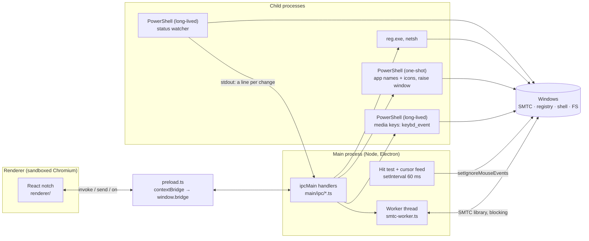
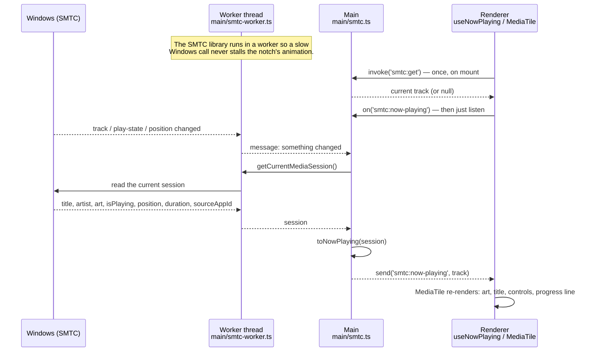
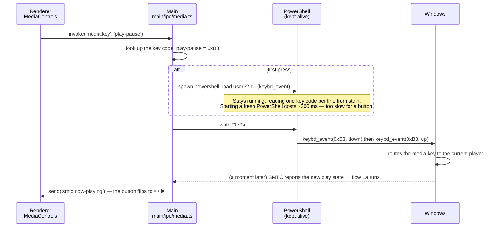
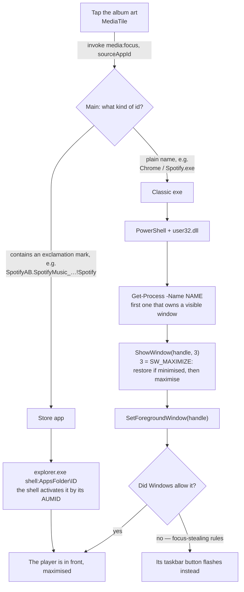
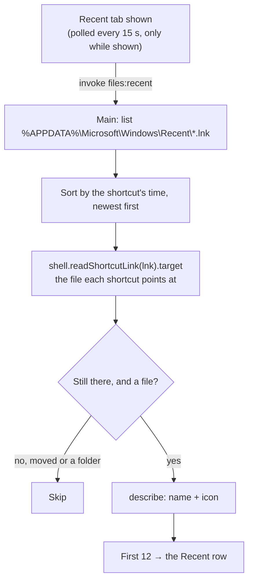
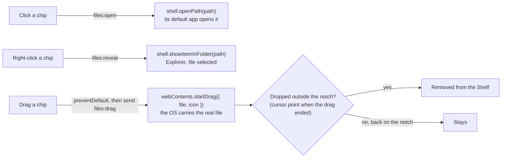
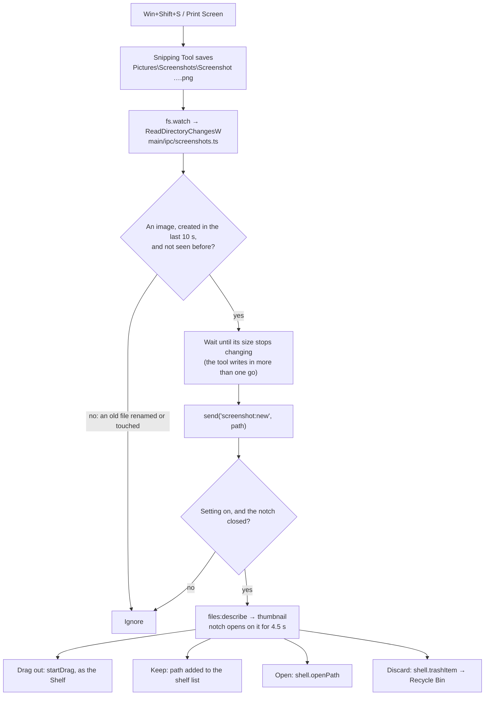
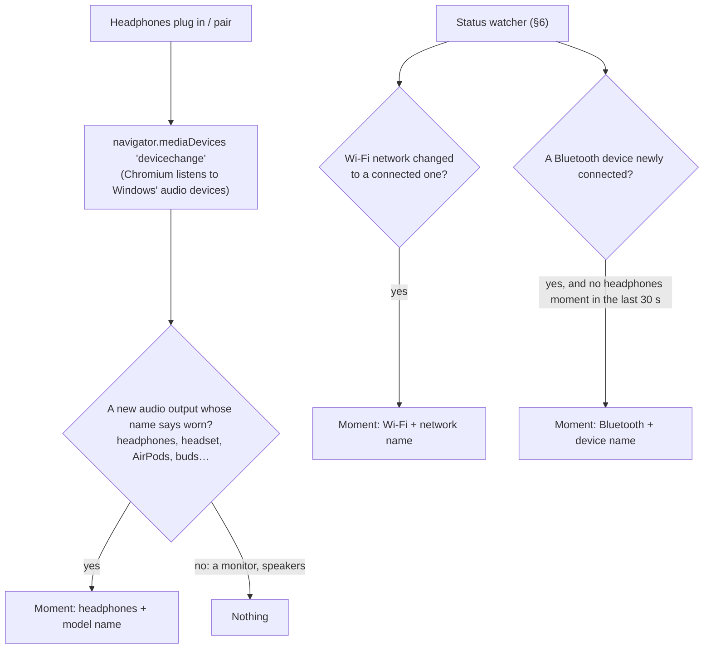
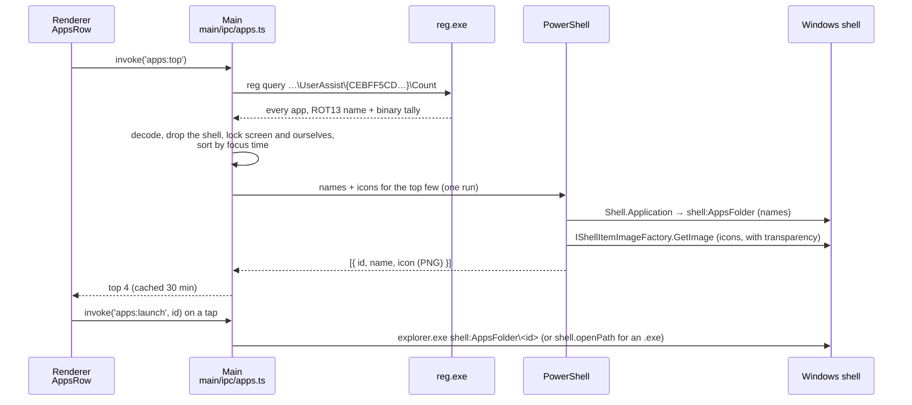

# How deskNotch talks to Windows

This file explains every place deskNotch reaches outside itself into Windows: reading what music is playing, noticing a screenshot, seeing that the microphone is on, and so on. Settings and tasks are left out; they are just a JSON file on disk.

**New to Electron?** Read *Start here* first. **Already know it?** Skip to *For engineers*: the architecture, the cost of every background task, the security model, and every design decision with the alternative it beat. It explains, from zero, the ideas every section below relies on. Each numbered section then opens with a short **In plain words** summary before the details, so you can read just those on a first pass.

> The diagrams are [Mermaid](https://mermaid.js.org/). GitHub draws them as they are; VS Code-based editors need the **Markdown Preview Mermaid Support** extension (`bierner.markdown-mermaid`), otherwise they show as code.

---

## Start here: Electron in five minutes

### What Electron is

A normal website runs in a browser tab and is not allowed to touch your computer: it cannot read your files, see which apps are open, or run programs. That is on purpose; any website could be malicious.

**Electron** lets you build a desktop app out of web technology (HTML, CSS, React) *and* gives it a way to touch the computer. It does this by running your app as **two separate programs** that talk to each other.

### The two halves: renderer and main

Think of a restaurant.

| | Restaurant | deskNotch | Folder |
|---|---|---|---|
| **Renderer** | The dining room: what guests see. Waiters take orders but never cook. | The notch you see: React components, animations, buttons. It is a browser tab, so it **cannot** touch Windows. | [renderer/](renderer/) |
| **Main** | The kitchen: guests never see it, but it can use the stove, the knives, the fridge. | A Node.js program with full access: files, the registry, running PowerShell, the window itself. | [main/](main/) |

They are separate processes and share no memory. The only way to get something from the kitchen is to **pass a note through the hatch**. In Electron that note-passing is called **IPC** (inter-process communication).

### The hatch: the preload bridge

The renderer is not given the whole kitchen, only a small, fixed hatch. That hatch is [main/preload.ts](main/preload.ts). It runs before the page loads and puts exactly four functions on `window.bridge`:

| Function | Meaning | Restaurant |
|---|---|---|
| `window.bridge.invoke('name', …)` | Ask main a question and **wait for the answer** (returns a Promise). | "One soup, please", then you wait for it. |
| `window.bridge.send('name', …)` | Tell main something; **no answer**. | "Table 4 is leaving." |
| `window.bridge.on('name', fn)` | Let main **tell the page** things whenever they happen. | The kitchen rings a bell: "order up". |
| `window.bridge.pathOf(file)` | The real disk path of a file dropped on the page. | (a special case, for the Shelf) |

The `'name'` is just a label, like `'files:describe'`. It only has to match on both sides. On the main side, the matching code is `ipcMain.handle('name', …)` (answers `invoke`) or `ipcMain.on('name', …)` (receives `send`), and `webContents.send('name', …)` rings the bell for `on`.

A real pair from this repo. The page asks for a file's details:

```ts
// renderer (the dining room): renderer/hooks/useFiles.ts
const items = await window.bridge.invoke('files:describe', ['C:\\Users\\me\\photo.jpg'])
```

and main answers it:

```ts
// main (the kitchen): main/ipc/files.ts
ipcMain.handle('files:describe', async (_event, paths) =>
  // stat each file, read its icon and thumbnail, send them back
)
```

That is the whole pattern. Every feature below is some version of **the page asks, or main tells, through the hatch**.

### How main actually talks to Windows

Main is Node.js, which can already read files and start programs. For the rest, deskNotch uses four tools, and **no native modules** (no C++ code that has to be compiled against Electron):

1. **Electron's own APIs**, which wrap Windows for you: `shell.openPath` (open a file with its app), `shell.trashItem` (Recycle Bin), `nativeImage` (thumbnails), `setIgnoreMouseEvents` (click-through).
2. **Node's `fs`**, for files and folders, including `fs.watch`, which Windows backs with a real "tell me when this folder changes" API.
3. **PowerShell**, Windows' built-in scripting shell. Main starts it as a child process, gives it a small script, and reads what it prints. PowerShell can read the **registry** (Windows' big settings database), call Windows APIs, and even compile a few lines of C#. It costs about 300ms to start, so the features that need it often keep **one PowerShell running** and reuse it.
4. **Command-line tools** Windows ships with, like `reg.exe` (read the registry) and `netsh` (network information).

### Follow one feature end to end: a screenshot

Here is everything that happens, in order, when you press **Win+Shift+S**. Every step names the file it happens in.

1. **Windows** saves the picture to `Pictures\Screenshots\Screenshot 2026-09-26 151904.png`. (Nothing of ours yet.)
2. **Main** has been watching that folder since start-up with `fs.watch` ([main/ipc/screenshots.ts](main/ipc/screenshots.ts)). Windows tells it a file appeared.
3. **Main** checks that it is a new image, and waits until the file stops growing (the Snipping Tool writes it in pieces).
4. **Main rings the bell:** `webContents.send('screenshot:new', path)`.
5. **The page** hears it, because [renderer/pages/home.tsx](renderer/pages/home.tsx) called `window.bridge.on('screenshot:new', …)`.
6. **The page asks** for a thumbnail: `window.bridge.invoke('files:describe', [path])`.
7. **Main answers** with the name, icon and a small preview image ([main/ipc/files.ts](main/ipc/files.ts)).
8. **The page** opens the notch on the capture card ([CaptureView.tsx](renderer/components/widgets/CaptureView.tsx)) for a few seconds.
9. You press **Discard**. **The page asks** `invoke('screenshot:discard', path)`, and **main** calls `shell.trashItem`, after checking the path really is inside the Screenshots folder. The page is never trusted to delete just anything.

Every other feature is the same shape with different steps. Section 5 draws this one as a diagram.

### Why the page never gets more power

It would be simpler to hand the page Node.js directly. It is not done because the renderer is a browser; if anything unexpected ever ran in it, it would have the run of your disk. So the page can only ask for **specific, named things**, and main double-checks each request (is this really a path? is this app one we listed?). You will see those checks called out below.

### The map: what each feature uses

| Mechanism | What it is | Used for |
|---|---|---|
| **SMTC** (System Media Transport Controls) | Windows' own "now playing" registry. Every player (Spotify, Chrome, Edge, VLC…) reports its track, artwork, play state and position to it. | Reading what's playing |
| **Media keys** | The play/pause/next/previous keys on a keyboard. Windows routes them to whichever player is current, no focus needed. | Controlling playback |
| **`user32.dll`** | The Windows window manager API. `ShowWindow` restores a window, `SetForegroundWindow` brings it to the front. | Opening the player |
| **Click-through window** | `setIgnoreMouseEvents(…, { forward: true })` on a transparent, always-on-top window. | The notch not blocking the desktop (§4) |
| **Shell drag and drop, thumbnails, Recycle Bin** | `webContents.startDrag`, `nativeImage.createThumbnailFromPath`, `shell.trashItem`. | The Shelf (§3), screenshots (§5) |
| **Folder change notifications** | `fs.watch`, which is `ReadDirectoryChangesW` underneath. | Catching screenshots (§5) |
| **CapabilityAccessManager** | The registry record behind Windows' own "an app is using your microphone" icon. | Privacy dots (§6) |
| **`netsh wlan`, PnP device properties** | Wi-Fi state, and whether each paired Bluetooth device is connected. | Wi-Fi and Bluetooth moments (§6, §7) |
| **Audio endpoints** | The browser's `devicechange` event over Windows' audio device list. | Headphones moment (§7) |
| **UserAssist** | Explorer's per-app launch and focus-time tally, behind the Start menu's "Most used". | Most used apps (§8) |
| **Shell `AppsFolder` + `IShellItemImageFactory`** | The Start menu's own list of apps, and the shell's icon renderer. | App names, icons, launching (§8) |

Every diagram below uses the same lanes: **Renderer** (the page), **Main** (the kitchen), and **Windows**.

---

## For engineers: architecture, costs, and why it is built this way

*Start here* is the concept; this is the engineering. Every number below is the one in the code.

### Process architecture



The rule it follows: **nothing slow or blocking runs on main's event loop**, because main also owns the window and relays every IPC message; a stall there freezes the notch. Blocking work goes to the worker thread (SMTC) or to a child process (everything PowerShell).

### Cost budget, idle and active

| Work | How often | Cost | Where |
|---|---|---|---|
| Cursor hit test | every 60 ms, always | one `getCursorScreenPoint` and a rectangle check; IPC only when the cursor moved | [main.ts](main/main.ts) |
| Now playing | event-driven (SMTC pushes) | one session read per change | worker thread |
| Media key | per click | a line to an already-running PowerShell (no 300 ms start-up) | [media.ts](main/ipc/media.ts) |
| Privacy dots | 1.5 s | a registry walk inside one long-lived PowerShell; silent unless changed | [privacy.ts](main/ipc/privacy.ts) |
| Wi-Fi | ~10.5 s (every 7th tick) | one `netsh` call, ~0.2 s | same process |
| Bluetooth | ~30 s (every 20th tick) | a batched PnP property query, ~1 to 2 s, since each device is asked | same process |
| Screenshots | event-driven | `fs.watch` (ReadDirectoryChangesW); zero cost when idle | [screenshots.ts](main/ipc/screenshots.ts) |
| Headphones | event-driven | Chromium's `devicechange`; nothing of ours runs | [useHeadphones.ts](renderer/hooks/useHeadphones.ts) |
| AI limits | every 2 min while shown, min gap 60 s | one HTTPS call per provider; 5 min back-off after a failure | [limits.ts](main/ipc/limits.ts) |
| Most used apps | once per 30 min | `reg query` + one PowerShell with a C# icon helper, ~2 to 4 s cold, then cached | [apps.ts](main/ipc/apps.ts) |

### Security model

- **The renderer is untrusted by design.** The window keeps Electron's defaults (context isolation on, Node integration off, sandbox on). The page gets four functions through `contextBridge`, never `ipcRenderer` or Node.
- **Every handler validates its input.** Paths must be absolute strings before they reach `shell` ([files.ts](main/ipc/files.ts)). **Discard** only accepts an image directly inside a Screenshots folder, then goes to the Recycle Bin, not `unlink` ([screenshots.ts](main/ipc/screenshots.ts)). **Launch** only accepts an app id that main itself listed (most used, or installed), never an arbitrary command ([apps.ts](main/ipc/apps.ts)).
- **No string-built shell commands from page input.** PowerShell scripts are constants; the one place data goes in (app ids for icons) is JSON, base64-encoded, and decoded inside the script, so no quoting can break out.
- **Credentials.** The Claude and Codex OAuth tokens are read from the files those tools already keep, used only in main, sent only to their own providers, and never passed to the renderer. No refresh is attempted, because refreshing would rotate the token the tool itself uses.
- **Focus.** The window takes keyboard focus only when pinned, so hovering never steals typing from another app.

### Decisions, and what was rejected

| Problem | Chosen | Rejected, and why |
|---|---|---|
| Smooth notch animation | One full-width transparent window; the notch is a `<div>` animated with springs | Resizing the `BrowserWindow`: `setBounds` steps on the compositor's schedule, cannot ease, and tears on transparent windows |
| Clicks through the empty window | Permanently click-through (`forward: true`), plus a 60 ms cursor poll against rectangles the page reports | Toggling on hover: `setIgnoreMouseEvents(false)` hands the **whole** strip the mouse, swallowing clicks meant for apps underneath. `setShape`: exists, but the shape would have to be re-sent on every frame of the spring animation |
| When to close the notch | Close only when the **real** cursor (from main) is 48 px away and still moving away | DOM `mouseleave`: fires falsely when a view shrinks under a still pointer, and when the window turns click-through at its edge; Chromium also sends synthetic moves during layout |
| Reading media | `SMTC` in a worker thread, change events as a trigger to re-read the whole session | On main: the library blocks its thread. Stitching partial events: every event carries a different subset, so ordering bugs are guaranteed |
| Controlling media | The system media keys via `keybd_event` | SMTC control calls: the library only observes. Per-player APIs: one integration per app |
| Screenshots | Watch the folder Snipping Tool saves to | Clipboard polling: reads a full bitmap every tick to detect change. Global keyboard hook: needs a native module and sees the key, not the result |
| Mic / camera state | The ConsentStore registry, which Windows' own tray icon uses | WinRT capability APIs: need NodeRT, a native module rebuilt per Electron version. No official API exists for "in use" |
| Most used apps | UserAssist, ranked by focus time | Running-process lists: show what is open, not what you use. Prefetch or event logs: need admin |
| App icons | `IShellItemImageFactory` via a small C# helper compiled in PowerShell | `app.getFileIcon`: needs an `.exe`, and most apps now are Store packages with none. Parsing each package's manifest for its logo: many formats, scale variants, fragile |
| Bluetooth | A slow, batched query every ~30 s, plus Chromium's instant `devicechange` for audio | Per-device queries (~9 s measured). WinRT `BluetoothDevice` watchers: native module again |
| Native code in general | None: Electron APIs, Node, PowerShell, stock CLI tools | NodeRT / N-API addons: every Electron upgrade needs a rebuild, and a crash in native code takes main down with it |

### Things that are subtle

- **`startDrag` is modal on Windows.** It runs the OS drag loop and returns only when the drop happens. Main times the call; if it blocked for over 120 ms, a real drag happened, and the cursor position at that moment says where it ended, so the Shelf knows whether the file left ([files.ts:140](main/ipc/files.ts#L140)).
- **The icon bitmap needs fixing.** `GetImage` returns a DIB section that is bottom-up and premultiplied-alpha. The helper wraps it as `Format32bppPArgb`, copies it, and flips it when the height is positive; otherwise icons come out upside down with black edges.
- **UserAssist names are ROT13** and its values are 72-byte blobs: launch count at bytes 4 to 7, focus time in ms at 12 to 15. Entries starting with `{` are known-folder GUID paths and are skipped.
- **ConsentStore semantics:** "in use" is `LastUsedTimeStop == 0` with a non-zero start. Apps that open the device outside Windows' permission broker never appear; it is best-effort by nature.
- **A screenshot file is written in several passes.** The watcher only fires once the size is stable across two reads 150 ms apart, and ignores files older than 10 s (renames and touches fire watch events too).
- **Rate limits.** Claude's usage endpoint is shared with Claude Code itself and returns 429 quickly. The last good reading is persisted to `userData/limits-cache.json`, so a restart shows numbers instead of "unavailable", and a failure backs off for 5 minutes unless the user presses retry.
- **Two PowerShells never leak.** The long-lived ones are killed on quit, and the status watcher also checks every tick that our process still exists, so a crash cannot leave it orphaned.

### How it fails

| If this fails | What the user sees |
|---|---|
| PowerShell is blocked or slow | The dots, moments and app icons are missing; everything else works |
| SMTC has no session | The media card disappears; the bar shows the time |
| An AI provider is down or rate-limiting | The last reading stays; with none, a retry card |
| The Screenshots folder does not exist | No catcher; the folder is skipped silently |
| An app in the favourites is uninstalled | It drops out of the row on the next lookup |

---

## 1. Media playback

> **In plain words:** Windows keeps one list of "what is playing right now" that every music and video app reports to. deskNotch listens to that list to show the song, and presses the keyboard's own media keys (play, next…) to control it, so it works with any player.

Two directions: **reading** what's playing (continuous) and **controlling** it (on click). They use different mechanisms, because the library we read with can only observe.

### 1a. Reading what's playing



Key points:

- **Push, not poll.** The worker subscribes to SMTC events and tells main when anything changes; main re-reads once and pushes to the renderer. The renderer asks only once, on mount, because main already knows the track before the UI exists.
- **Position** arrives only when SMTC reports a change (every few seconds for most players). Between reports the progress line keeps moving at real time while playing, so it never looks stalled: [useMediaProgress.ts:9](renderer/hooks/useMediaProgress.ts#L9).
- **`sourceAppId`** is the player's identity (`Chrome`, `Spotify.exe`, or a Store app id like `SpotifyAB.SpotifyMusic_…!Spotify`). Feature 2 needs it.

Where the code is:

| Step | File |
|---|---|
| Worker: subscribes to SMTC, forwards events | [main/smtc-worker.ts:111](main/smtc-worker.ts#L111) |
| Main: spawns the worker, re-reads on events, pushes to the UI | [main/smtc.ts:63](main/smtc.ts#L63), [smtc.ts:65](main/smtc.ts#L65), [smtc.ts:70](main/smtc.ts#L70), [smtc.ts:103](main/smtc.ts#L103) |
| Renderer: asks once, then listens | [renderer/hooks/useNowPlaying.ts:22](renderer/hooks/useNowPlaying.ts#L22) |
| Renderer: the card | `MediaTile` in [renderer/components/widgets/GlanceTiles.tsx:22](renderer/components/widgets/GlanceTiles.tsx#L22) |

### 1b. Controlling playback (play / pause / next / previous)

The SMTC library only *observes*; it has no play or skip method. So the buttons send the **system media keys**, exactly what a keyboard sends, which every player honours whether or not it has focus.



Key points:

- **One long-lived PowerShell** for keys, not one per press. It is started on the first press and killed when the app quits ([media.ts:32](main/ipc/media.ts#L32)).
- **No optimistic UI.** The button doesn't flip itself; it flips when SMTC confirms the change (usually within ~100 ms). What you see is always the truth.
- **Key codes:** `play-pause` 0xB3, `next` 0xB0, `previous` 0xB1 ([media.ts:11](main/ipc/media.ts#L11)).
- **Two players open?** Windows sends the key to whichever it considers current, same as your keyboard would.

Where the code is:

| Step | File |
|---|---|
| Buttons call `media:key` | [GlanceTiles.tsx:75-77](renderer/components/widgets/GlanceTiles.tsx#L75-L77) |
| Handler + key server | [main/ipc/media.ts:69](main/ipc/media.ts#L69), [media.ts:32](main/ipc/media.ts#L32) |

---

## 2. Opening the player (tap the album art)

> **In plain words:** Tapping the album art finds the window of the app that is playing (Spotify, Chrome…) and brings it to the front, the same thing clicking it on the taskbar does.

Tapping the art brings the app that's playing to the front, maximised. It relies on the `sourceAppId` that SMTC gave us in 1a.



Key points:

- **Store apps vs exes** are different animals. A Store app has no exe you can name; the shell activates it by its AUMID. A classic app is found by process name.
- **Best effort.** Windows may refuse to hand focus from one process to another. When it does, the target's taskbar button flashes, which is the OS's own fallback, not ours.
- **Safety:** the id is validated against `^[\w.!-]+$` before it goes anywhere near a shell command ([media.ts:74](main/ipc/media.ts#L74)).

Where the code is:

| Step | File |
|---|---|
| The art is a button | [GlanceTiles.tsx:34-38](renderer/components/widgets/GlanceTiles.tsx#L34-L38) |
| Handler, Store branch, exe branch | [main/ipc/media.ts:73](main/ipc/media.ts#L73), [media.ts:75](main/ipc/media.ts#L75), [media.ts:59](main/ipc/media.ts#L59) |

---

## 3. The Shelf tab (Recent and Pinned parked)

> **In plain words:** A place to park files. Drop a file on the notch and its path is saved; drag it back out and Windows moves the real file wherever you drop it. Thumbnails come from the same place Explorer gets them.

> **Current state:** only the Shelf is shown — a slim tray, left to right, that widens per file up to 640px and then scrolls sideways; files show a thumbnail where Windows has one, and a file dragged out and dropped elsewhere leaves the shelf. Recent and Pinned are commented out in `FileStrip.tsx`; their code below still exists and comes back by uncommenting.

Its own view in the notch (the Shelf circle on the side rail), with a switch between three lists. It replaced an open-apps dock, which only duplicated the taskbar, and moved off the Desk so the Desk stays about focus and tasks.

| Tab | What it holds | Where it comes from | Saved? |
|---|---|---|---|
| **Shelf** | Files you parked for later | Dropped onto the strip | Yes, store key `shelf` |
| **Recent** | Files you opened lately | Windows' own Recent folder | No, read live |
| **Pinned** | Favourite files and folders | Dropped onto the strip | Yes, store key `pins` |

Every file chip works the same: **click** opens it, **right-click** shows it in its folder, **drag** carries the real file out to wherever you drop it. Shelf and Pinned chips have a remove × on hover.

### 3a. Dropping files in

```mermaid
sequenceDiagram
    participant X as Explorer / desktop
    participant R as Renderer<br/>home.tsx + FileStrip
    participant P as Preload<br/>main/preload.ts
    participant M as Main<br/>main/ipc/files.ts

    X->>R: a file is dragged over the notch, even collapsed (dragenter)
    R->>R: open the notch on Files › Shelf and lock it open,<br/>outline the drop area in the companion's colour
    X->>R: drop
    R->>P: bridge.pathOf(file)
    Note over P: Electron 43 no longer puts .path on File;<br/>webUtils.getPathForFile gives the real path.
    P-->>R: "D:\Work\notes.txt"
    R->>M: invoke('files:describe', [paths])
    M->>M: stat each path, read its icon (cached as an image)
    M-->>R: [{ path, name, isDir, icon }]
    R->>R: add to the Shelf (or Pinned) and save the paths
```

### 3b. Recent files



### 3c. Opening, revealing, dragging out



On Windows `startDrag` runs the system drag loop and only returns when the drag ends, so the main process reads `screen.getCursorScreenPoint()` right then and the renderer checks it against the notch's rectangle ([files.ts:140](main/ipc/files.ts#L140)). Thumbnails come from the image itself for pictures, and from `nativeImage.createThumbnailFromPath` (the same thumbnails Explorer shows) for videos, PDFs and the rest ([files.ts:40](main/ipc/files.ts#L40)).

Every path is checked to be absolute before it reaches the shell ([files.ts](main/ipc/files.ts)).

Where the code is:

| Step | File |
|---|---|
| The strip, its tabs, chips, drop zone | `FileStrip` in [renderer/components/widgets/FileStrip.tsx:78](renderer/components/widgets/FileStrip.tsx#L78) |
| Chip drag-out | [FileStrip.tsx:32](renderer/components/widgets/FileStrip.tsx#L32) |
| Drop handling | [FileStrip.tsx:118](renderer/components/widgets/FileStrip.tsx#L118) |
| Opening the notch on Files when a file is dragged in | [renderer/pages/home.tsx](renderer/pages/home.tsx) (the `dragenter` listener) |
| Locking it open on a file drag | `onDragEnter` in [renderer/components/notch/NotchChassis.tsx](renderer/components/notch/NotchChassis.tsx) |
| Saved lists, recent polling, dropped paths | [renderer/hooks/useFiles.ts:15](renderer/hooks/useFiles.ts#L15), [useFiles.ts:46](renderer/hooks/useFiles.ts#L46), [useFiles.ts:73](renderer/hooks/useFiles.ts#L73) |
| `pathOf` for dropped files | [main/preload.ts:12](main/preload.ts#L12) |
| Describe, recent, open, reveal, drag | [main/ipc/files.ts:33](main/ipc/files.ts#L33), [files.ts:55](main/ipc/files.ts#L55), [files.ts:94-103](main/ipc/files.ts#L94-L103) |

---

## 4. The notch window itself (click-through)

> **In plain words:** The notch is drawn inside an invisible window as wide as your screen. So that the invisible part never steals your clicks, main checks where the mouse is 16 times a second and only lets the window take the click when you are actually over the notch.

The notch lives in a transparent, frameless, always-on-top window as wide as the screen and 500px tall. Almost all of that window is empty, and it must never swallow a click meant for whatever is underneath.

```mermaid
sequenceDiagram
    participant R as Renderer<br/>NotchChassis
    participant M as Main<br/>main/main.ts
    participant W as Windows

    R->>M: send('notch:bounds', [notch, dock, apps bar])<br/>on every resize (ResizeObserver)
    loop every 60 ms
        M->>W: screen.getCursorScreenPoint()
        M->>M: is the cursor inside any of those rectangles?
        M->>W: setIgnoreMouseEvents(!inside, { forward: true })
        M-->>R: send('notch:cursor', {x, y}) when the cursor moved
    end
    R->>R: pointer left? close only once it is 48px away<br/>and still heading away
    R->>M: send('notch:pinned', true) when locked
    M->>W: mainWindow.focus() (so typing works); blur() when unlocked
```

- Outside the rectangles, the window ignores the mouse and Windows delivers clicks to what is below. `forward: true` still lets the page see mouse moves.
- Closing uses the **real cursor from the main process**, not browser events: past the edge the window stops taking the mouse, so the page is told the pointer left the moment it crosses, and while the notch resizes under a still pointer the browser sends moves that are not real. So the notch closes only on real movement away ([NotchChassis.tsx:151](renderer/components/notch/NotchChassis.tsx#L151)).
- Code: the hit test and cursor feed at [main.ts:60](main/main.ts#L60), bounds at [main.ts:93](main/main.ts#L93), focus on lock at [main.ts:99](main/main.ts#L99).

## 5. Screenshot catcher

> **In plain words:** Windows saves every screenshot into a folder. deskNotch watches that folder, and when a new picture appears it opens the notch on it so you can drag it somewhere, keep it, or throw it away.

Windows 11's Snipping Tool (Win+Shift+S, Print Screen) saves every capture to `Pictures\Screenshots`. Watching that folder catches them as real files, for the cost of a folder watch: no polling.



- Watches `Pictures\Screenshots`, and `OneDrive\Pictures\Screenshots` when it exists.
- **Discard** goes to the Recycle Bin, so a slip can be undone, and the main process refuses any path that is not an image directly inside one of those folders ([screenshots.ts:38](main/ipc/screenshots.ts#L38)).
- Code: the watcher at [screenshots.ts:46](main/ipc/screenshots.ts#L46), the size check at [screenshots.ts:25](main/ipc/screenshots.ts#L25), the card in [CaptureView.tsx](renderer/components/widgets/CaptureView.tsx), opening and folding in `peek` in [home.tsx](renderer/pages/home.tsx).

## 6. Status watcher: privacy dots, Wi-Fi, Bluetooth

> **In plain words:** One small PowerShell script runs in the background and keeps asking Windows three questions: is any app using the mic or camera, which Wi-Fi am I on, and which Bluetooth devices are connected. It only speaks up when an answer changes.

One PowerShell, kept alive, answers three questions and prints a line only when an answer changes.

**Microphone and camera.** Windows keeps, for its own tray icon, a record of every app that has asked for either:

```
HKCU\Software\Microsoft\Windows\CurrentVersion\CapabilityAccessManager\ConsentStore\
    microphone\<app>\  LastUsedTimeStart, LastUsedTimeStop
    webcam\<app>\      LastUsedTimeStart, LastUsedTimeStop
```

A `LastUsedTimeStop` of **0** (with a start time set) means "still using it right now".

**Wi-Fi.** `netsh wlan show interfaces`: its State, SSID and Signal lines.

**Bluetooth.** `Get-PnpDevice -Class Bluetooth`, keeping real devices (not the radio, adapters or profiles), then each one's "is connected" device property (`{83DA6326-97A6-4088-9453-A1923F573B29} 15`). Asking every device takes a second or two, so this runs least often.

```mermaid
sequenceDiagram
    participant R as Renderer<br/>usePrivacy, home.tsx
    participant M as Main<br/>main/ipc/privacy.ts
    participant P as PowerShell (one, kept alive)
    participant W as Windows

    R->>M: invoke('privacy:get') (first ask starts the watcher)
    M->>P: spawn, with our process id
    loop every 1.5 s
        P->>W: ConsentStore: any mic / webcam app with Stop = 0?
        P->>W: every ~10 s: netsh wlan show interfaces
        P->>W: every ~30 s: connected Bluetooth devices
        P-->>M: "mic,camera TAB ssid|signal TAB device;device" (only when it changed)
        M-->>R: send('privacy:state', { mic, camera, wifi, bluetooth })
    end
    Note over P: exits by itself if our process is gone
```

What the closed bar does with it:

- **Privacy dots**, all the time: orange while the microphone is in use, green for the camera, as on the iPhone.
- **Wi-Fi and Bluetooth** are not shown all the time. They get a moment (§7) only when something **connects**: a new network, or a Bluetooth device that was not connected before.

Code: [privacy.ts](main/ipc/privacy.ts) (script and watcher), [usePrivacy.ts](renderer/hooks/usePrivacy.ts).

## 7. "Just connected" moments (headphones, Wi-Fi, Bluetooth)

> **In plain words:** When something connects, the closed notch shows it for a second and a half, like AirPods on an iPhone. Headphones are noticed by the browser itself; Wi-Fi and Bluetooth come from the watcher in §6.

When something connects, the closed bar gives itself to it for about a second and a half: the icon swings in, then the name and "Connected", then it slides away and the usual bar returns.



- What is already connected when the app starts is not news: Wi-Fi and Bluetooth changes count only after a 12 s warm-up, and devices present at start are remembered.
- A Bluetooth headset shows as both headphones (instantly, from `devicechange`) and a Bluetooth device (later, from the watcher); the headphones moment wins, so it is not announced twice.

Code: [useHeadphones.ts](renderer/hooks/useHeadphones.ts), the moments in [home.tsx](renderer/pages/home.tsx), the view in [CollapsedStatus.tsx](renderer/components/notch/CollapsedStatus.tsx).

## 8. Most used and favourite apps

> **In plain words:** Windows secretly counts how long you use each app (that is where the Start menu's "Most used" comes from). deskNotch reads that count, asks Windows for each app's real name and icon, and launches an app the same way the Start menu does.

**Most used** is Windows' own count. Explorer keeps a tally per app under `UserAssist` (the Start menu's "Most used" is built from it). Each value's name is the app, **ROT13-encoded**, and its 72-byte data holds the launch count (bytes 4–7) and **time in focus in ms** (bytes 12–15).



- An app's id is its **AppUserModelID** (`Chrome`, `5319275A.WhatsAppDesktop_…!App`) or an `.exe` path. `shell:AppsFolder\<id>` launches either kind, Store apps included.
- **Favourites** are picked from the whole `shell:AppsFolder` list (every app in the Start menu), searched by name; names and icons come from the same PowerShell pass, cached per app.
- Icons: most apps are Store-style and have no `.exe` Electron can read an icon from, so a small C# helper (compiled in PowerShell with `Add-Type`) asks the shell's own icon renderer, the same icons the Start menu shows.
- The page can only launch an id the main process has itself listed (most used, or installed), never an arbitrary path ([apps.ts:163](main/ipc/apps.ts#L163)).
- Code: tally at [apps.ts:25](main/ipc/apps.ts#L25), ROT13 at [apps.ts:22](main/ipc/apps.ts#L22), names and icons at [apps.ts:44](main/ipc/apps.ts#L44), the installed list at [apps.ts:131](main/ipc/apps.ts#L131).

## 9. Smaller touches

> **In plain words:** A few small things that also read from Windows: your wallpaper (to tint the glass), your accent colour, and the "start with Windows" switch.

| What | How it talks to Windows | Code |
|---|---|---|
| Glass tint from the wallpaper | Reads `%APPDATA%\Microsoft\Windows\Themes\TranscodedWallpaper`, the copy of the current wallpaper Windows keeps | [system.ts:20](main/ipc/system.ts#L20) |
| Accent colour | `systemPreferences.getAccentColor()`, the colour set in Personalisation | [system.ts:40](main/ipc/system.ts#L40) |
| 12-hour clock | Built from the system time; the closed bar shows it on the left whenever no focus session or music is running | [time.ts](renderer/lib/time.ts) |
| Start on boot | `app.setLoginItemSettings({ openAtLogin })`, which writes the `HKCU\…\Run` registry entry | [settings.ts:6](main/ipc/settings.ts#L6) |
| AI limits | Reads the login Claude Code and Codex keep in your user folder, then calls only their own servers | [limits.ts](main/ipc/limits.ts) |

---

## The one shared piece: the `user32.dll` shim

Features 1 and 2 need these Windows functions. They are declared once, as a PowerShell `Add-Type` block, and reused:

```powershell
public class W {
  ShowWindow(IntPtr h, int n)        // 3 = maximise, 9 = restore
  SetForegroundWindow(IntPtr h)      // bring to front (Windows may refuse)
  keybd_event(byte vk, …)            // press a key — feature 1b
}
```

Defined at [main/ipc/media.ts:14](main/ipc/media.ts#L14).

## Known limits, in one place

- **Focus can be refused.** `SetForegroundWindow` is subject to Windows' focus-stealing rules. When refused, the target flashes on the taskbar. There is no reliable way around this without the target's cooperation.
- **Media keys go to the "current" player.** With two players open, Windows decides which one, not us.
- **Store apps** are opened by AUMID rather than found by name.
- **PowerShell start-up** costs ~300 ms. The key server avoids it for playback; bringing the player forward pays it, since it is rare.
- **Recent files** come from Windows' Recent folder, so they include anything Windows recorded — clearing that list in Windows clears the tab too.
- **Position updates** depend on the player. Most report every few seconds; the progress line interpolates between reports.
- **Screenshots** are caught only when Snipping Tool saves them (its "Automatically save screenshots" setting); a capture copied to the clipboard only is missed.
- **Privacy dots** lag a change by up to 1.5 s (polled, not watched), and follow what Windows records: an app that talks to the device outside Windows' permission system would not show.
- **Wi-Fi and Bluetooth moments** lag by up to ~10 s and ~30 s: the Bluetooth check asks every paired device, which is too slow to do often. Ethernet has no moment.
- **Headphones** are recognised by name; a pair whose driver calls it something unusual ("Speakers (…)") is not.
- **Most used** reflects Windows' own tally, which Windows can reset (a new profile, some privacy cleaners); apps Windows cannot name are skipped.
- **Icons** take about 2 s the first time (PowerShell compiles the helper), then come from the cache.


---

## Glossary

| Term | Meaning |
|---|---|
| **Electron** | A framework for desktop apps built with web technology; each app runs as a renderer (the page) and a main process (with system access). |
| **Renderer** | The page you see: React, running in a browser tab inside the app. Cannot touch Windows. [renderer/](renderer/) |
| **Main process** | The Node.js side with full system access. [main/](main/) |
| **IPC** | Inter-process communication: the messages between renderer and main. |
| **Preload / bridge** | [main/preload.ts](main/preload.ts): the only functions the page is given (`window.bridge`). |
| **`invoke` / `handle`** | Ask and answer: the page `invoke`s, main `handle`s and returns a value. |
| **`send` / `on`** | One-way messages; `webContents.send` is main telling the page. |
| **Channel** | The name on a message, like `'files:describe'`. |
| **Node.js** | JavaScript outside the browser, with files, processes and networking. |
| **PowerShell** | Windows' built-in scripting shell; main runs small scripts in it and reads their output. |
| **Registry** | Windows' central settings database, a tree of keys and values (`HKCU\Software\…`). |
| **`HKCU`** | "HKEY_CURRENT_USER": the part of the registry for the signed-in user. |
| **SMTC** | System Media Transport Controls: Windows' shared "now playing" list. |
| **`user32.dll`** | The Windows library that manages windows and keyboard input. |
| **AUMID** | AppUserModelID: Windows' name for an installed app, like `Chrome` or `5319275A.WhatsAppDesktop_…!App`. |
| **`shell:AppsFolder`** | A virtual folder holding every app in the Start menu; opening `shell:AppsFolder\<AUMID>` launches that app. |
| **UserAssist** | A registry key where Explorer counts how often, and how long, you use each app. |
| **ConsentStore** | The registry record of which apps used the microphone or camera, and when. |
| **ROT13** | A trivial letter shift (A↔N, B↔O…) Windows uses to scramble UserAssist names. |
| **Native module** | Compiled C/C++ code loaded by Node; powerful but has to be rebuilt for each Electron version. deskNotch uses none. |
| **Worker thread** | A second JavaScript thread in main, so slow work (media) never freezes the notch. |
| **Click-through** | A window that lets mouse clicks pass to whatever is underneath it. |
| **Hit test** | Checking whether the mouse is over the notch, to decide who gets the click. |
| **Mermaid** | A text format for diagrams, used throughout this file. |
